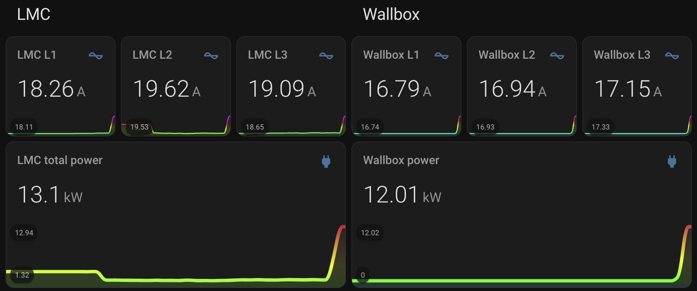

# VOOL Home Assistant Integration

A Home Assistant custom integration for [VOOL](https://www.vool.com/) [EV charger Wallbox](https://www.vool.com/products/vool-charger/) and Load Management Controller ([LMC](https://www.vool.com/products/vool-lmc/)) via Cloud API.

## Features

- **Real-time monitoring**: Power (kW), current (A), voltage (V) per phase
- **Multi-device support**: Both VOOL Charger (Wallbox) and LMC devices
- **Energy Dashboard compatible**: Proper sensor device classes and state classes
- **Cloud-based**: Uses VOOL Cloud API for data retrieval

## Installation

### HACS (Recommended)

1. Ensure you have [HACS](https://hacs.xyz/) installed
2. Go to HACS → Integrations → ⋮ (menu) → Custom repositories
3. Add this repository URL: `https://github.com/martinkenk/vool_ha`
4. Select category: **Integration**
5. Click **Add**
6. Search for "VOOL" in HACS and install it
7. Restart Home Assistant

### Manual Installation

1. Download the latest release from the [releases page](https://github.com/martinkenk/vool_ha/releases)
2. Extract the `custom_components/vool` folder to your Home Assistant `config/custom_components/` directory
3. Restart Home Assistant

## Configuration

1. Go to **Settings** → **Devices & Services**
2. Click **+ Add Integration**
3. Search for "VOOL"
4. Enter your credentials:
   - **Email**: Your VOOL account email
   - **Password**: Your VOOL account password  
   - **LMC Device ID**: Your LMC device ID
   - **Wallbox Device ID**: Your Wallbox device ID
   - **Scan Interval**: Polling interval in seconds (default: 300)

### Finding Device IDs

Device IDs can be found by logging into your VOOL account at [app.vool.com](https://app.vool.com) and navigating to the device overview page. The ID is part of the URL: `https://app.vool.com/devices/{device-id}/overview`

## Entities

### Sensors

| Entity | Description | Unit |
|--------|-------------|------|
| Active Power | Current power consumption | kW |
| Current L1/L2/L3 | Per-phase current | A |
| Voltage L1/L2/L3 | Per-phase voltage | V |

## Example Dashboard

You can create a dashboard to monitor your home and EV charger energy usage:

## Troubleshooting

### Cannot connect to VOOL API
- Verify your email and password are correct
- Check your internet connection
- Ensure the VOOL API is accessible

### Values not updating
- Check the scan interval setting
- Verify your device IDs are correct
- Check the Home Assistant logs for errors

## Contributing

Contributions are welcome! Please read our [Contributing Guidelines](CONTRIBUTING.md) before submitting a pull request.

## License

This project is licensed under the MIT License - see the [LICENSE](LICENSE) file for details.

## Disclaimer

This integration is not officially affiliated with VOOL. Use at your own risk.