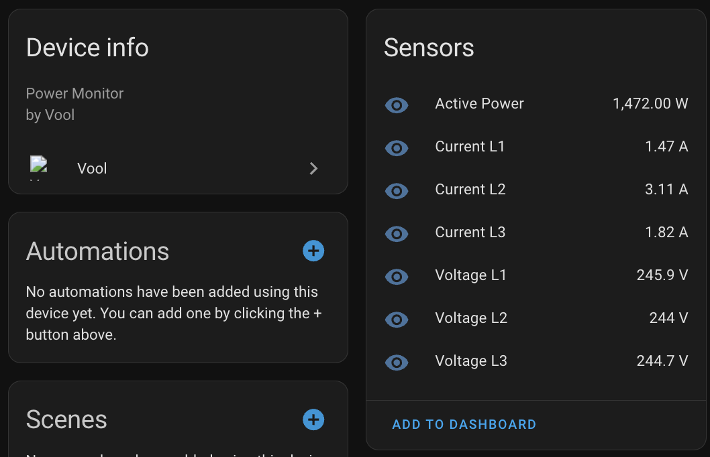

# VOOL Home Assistant integration

This integration hooks to your [VOOL](https://www.vool.com/) [EV charger Wallbox](https://www.vool.com/products/vool-charger/) and Load Management Controller ([LMC](https://www.vool.com/products/vool-lmc/)) data and records usage of all power phases and total power. That info can then be used in automations etc.

## Installation
To install the VOOL Home Assistant integration, follow these steps:

1. Open your Home Assistant configuration directory.
2. If you don't have a `custom_components` directory, create one.
3. Inside the `custom_components` directory, create a new directory called `vool`.
4. Download latest release from the [VOOL Home Assistant GitHub repository](https://github.com/martinkenk/vool_ha/releases/)
5. Unzip the contents into the `vool` directory on your HA host that was created inn step #3.
6. Make sure the python dependency `PyJWT` is installed on your HA setup.
7. Restart Home Assistant to load the integration.

## Usage
Once the VOOL integration is installed, you can configure it by adding it as an integration to your HA instance
 and 

then inserting the required information

 
The Wallbox and LMC device ID can be retreived by logging into your VOOL account on their webpage and navigation to the Wallbox or LMC overview page. The ID will be part of the URL https://app.vool.com/devices/{device-id}/overview. Just copy the value from there.

The default polling interval is 300 sec. To get representative current data and if your HA hardware is powerful enough it should be set to a lower value (30-60 sec).

Once the integration is successfully configured, you will be able to access the VOOL Wallbox and LMC `actual power`, `phase current` and `phase voltage` data and use it in your automations and scripts.

## What next?
You can for example create a dashboard to get an overview of your home and also EV charger energy usage and trends. 
